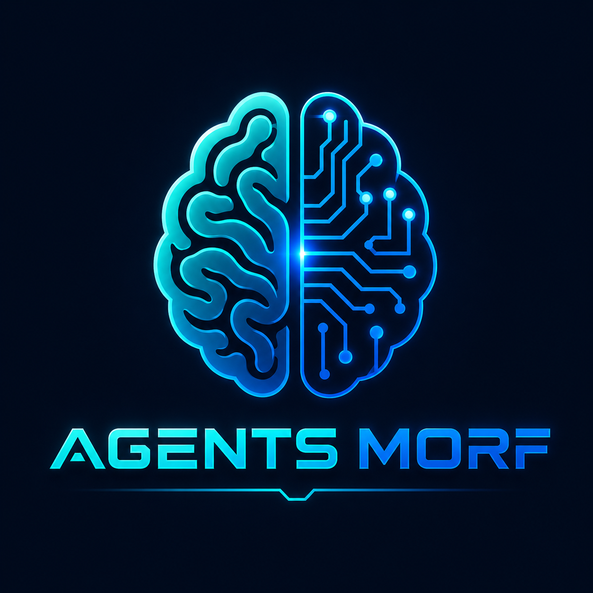

<div align="center">
  

# Agents Morf

## The Autonomous AI Agent Operating System

**Agents Morf** is an open, multi-tenant platform for building, training, operating and monitoring autonomous business agents that converse naturally and execute real work.

[Architecture](docs/ARCHITECTURE.md) · [Deployment](docs/DEPLOYMENT.md) · [API](docs/API.md) · [Security](docs/SECURITY.md) · [Roadmap](docs/ROADMAP.md)
</div>

---

## What it is

Agents Morf is not a single chatbot. It is an operating layer for AI workers that can qualify leads, sell products, answer support questions, schedule appointments, manage restaurant reservations, recommend menu items, create orders, trigger calls, send email and invoke external business APIs.

The repository provides a production-oriented foundation with:

- **Python 3.12 + FastAPI** backend
- **React + Vite + TypeScript** administration and Studio interface
- PostgreSQL, Redis and optional Qdrant/Ollama services
- Multi-organization isolation and role-based access
- Provider adapters for OpenAI-compatible APIs, Gemini, Anthropic-compatible APIs and Ollama
- Autonomous sales, reservations, restaurant catalog, orders and call-job modules
- SMTP2GO integration using environment variables only
- Docker Compose, Nginx, Cloudflare-ready deployment and health checks
- OpenAI-style `/api/v1/chat/completions` endpoint
- Structured audit-ready data models and request IDs

## Business agents

### Autonomous sales agent

The sales module is designed to:

- capture and qualify leads
- discover customer needs through natural conversation
- recommend products or services
- create follow-up actions
- record objections and buying intent
- create orders or reservation requests
- call approved tools and business APIs
- hand off to a human when confidence or policy requires it

### Restaurant and hospitality agent

The restaurant module can:

- show available menu items
- answer questions about descriptions, prices and allergens
- create and update customer orders
- request, confirm and cancel reservations
- preserve party size, date, time and customer notes
- trigger confirmation email or a call job
- hand off exceptional requests to staff

### Scheduling and call orchestration

The platform includes provider-neutral records and endpoints for:

- appointment and table reservations
- outbound call jobs
- call status webhooks
- future Twilio, Vonage, Telnyx or SIP integrations

Actual telephone calls require credentials and an account with a telephony provider; the code intentionally contains no hidden credentials.

## Supported AI providers

Agents Morf is provider-neutral. Adapters are included for:

- OpenAI-compatible APIs
- Google Gemini REST API
- Anthropic-compatible Messages API
- Ollama local models
- Groq, OpenRouter, Mistral, DeepSeek, xAI and other vendors that expose an OpenAI-compatible endpoint

Providers may offer trials or limited free tiers, but availability and pricing are controlled by each provider. **Ollama is the local option** for models that can run on your own hardware.

## Architecture

```text
Cloudflare
    │
    ▼
Nginx
    ├── React/Vite static application
    └── /api/* → FastAPI Gateway
                    ├── Authentication + tenant resolution
                    ├── Agent orchestration + tool router
                    ├── Provider gateway + fallbacks
                    ├── PostgreSQL
                    ├── Redis
                    ├── Qdrant (optional RAG)
                    ├── Ollama (optional local inference)
                    └── Worker processes
```

## Repository layout

```text
agents-Morf/
├── apps/
│   ├── backend/          FastAPI application, models, APIs and services
│   └── frontend/         React/Vite administration and Studio UI
├── docs/                 Architecture, deployment, API and security docs
├── infrastructure/nginx/ Production reverse-proxy configuration
├── scripts/              Bootstrap, deployment and backup helpers
├── .github/workflows/    Continuous integration
├── docker-compose.yml
├── .env.example
└── Makefile
```

## Quick start with Docker

```bash
cp .env.example .env
# Generate secure values before production:
# openssl rand -hex 32

docker compose up -d --build

docker compose exec backend python -m app.cli create-admin \
  --email admin@example.com \
  --password 'CHANGE_THIS_NOW' \
  --organization 'CodeMorf'
```

Open:

- Frontend: `http://localhost`
- API docs: `http://localhost/api/docs`
- Health: `http://localhost/api/v1/health`

## Local development

Backend:

```bash
cd apps/backend
python -m venv .venv
source .venv/bin/activate
pip install -e '.[dev]'
cp ../../.env.example ../../.env
uvicorn app.main:app --reload --port 8000
```

Frontend:

```bash
cd apps/frontend
npm install
npm run dev
```

## Environment and secrets

Copy `.env.example` to `.env`. Never commit `.env`, provider keys, SMTP2GO keys, JWT secrets or encryption keys.

The previously shared SMTP2GO key must be rotated before use. Set only the replacement key in the server-side `.env`:

```env
SMTP2GO_API_KEY=
MAIL_FROM_ADDRESS=it@codemorf.tech
MAIL_FROM_NAME=Agents Morf
```

## API examples

Login:

```bash
curl -X POST http://localhost/api/v1/auth/login \
  -H 'Content-Type: application/json' \
  -d '{"email":"admin@example.com","password":"CHANGE_THIS_NOW"}'
```

Chat completion:

```bash
curl -X POST http://localhost/api/v1/chat/completions \
  -H 'Authorization: Bearer YOUR_ACCESS_TOKEN' \
  -H 'X-Organization-ID: YOUR_ORGANIZATION_ID' \
  -H 'Content-Type: application/json' \
  -d '{
    "agent_id":"YOUR_AGENT_ID",
    "messages":[{"role":"user","content":"I need a table for four tomorrow at 8 PM"}],
    "stream":false
  }'
```

## Production domain

The supplied Nginx configuration is prepared for:

```text
https://agent.codemorf.tech
```

Use Cloudflare **Full (strict)** after a valid origin certificate is installed. Do not cache `/api/*` or authenticated HTML.

## Current scope

This repository is a working, extensible foundation and executable MVP. The core authentication, tenancy, agent, provider, lead, reservation, catalog, order, call-job and chat flows are implemented. External payment, calendar, CRM, WhatsApp and telephony providers require their own credentials and adapters before they can execute real third-party actions.

## License

Apache License 2.0. See [LICENSE](LICENSE).
